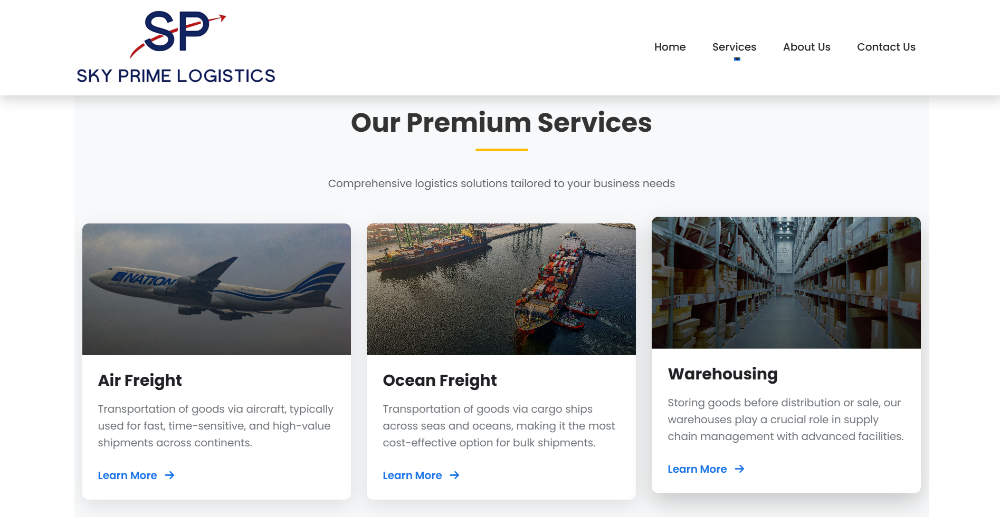
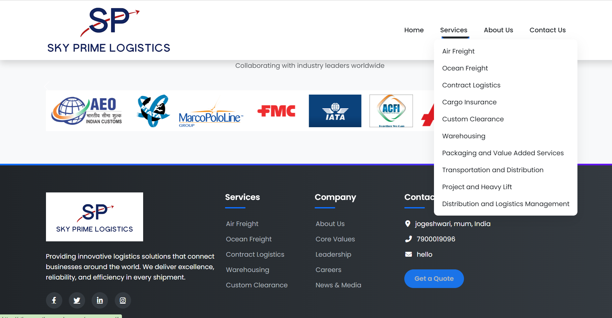

# Sky Prime Logistics Website

A professional logistics and freight service website built with **Django** and deployed on **PythonAnywhere**.  
This project presents a modern company website for a logistics business, showcasing services, company information, contact details, and a visually engaging user interface.

## Live Demo
[View Live Project](https://atharvar.pythonanywhere.com/)

## GitHub Repository
[View Source Code](https://github.com/AtharvaRavale/new-log)

---

## About the Project

Sky Prime Logistics Website is a responsive business website developed using Django.  
It is designed to represent a logistics and freight company online, with dedicated pages for company information, services, customer care, and contact details.

The website focuses on:
- clean navigation
- responsive design
- multiple service pages
- modern UI with animations
- static media integration such as images and video backgrounds

---


## Screenshots

### Home Page


### Services Page



---

## Features

- Responsive homepage with hero section
- Multi-page company website structure
- Dedicated service pages for logistics operations
- About Us and company-related pages
- Contact Us page
- Customer care page
- Event gallery and press release pages
- Bootstrap-based responsive design
- Animated sections using AOS
- Font Awesome icons integration
- Static asset support for images and video
- Django template-based routing

---

## Services Included

- Air Freight
- Ocean Freight
- Contract Logistics
- Cargo Insurance
- Custom Clearance
- Warehousing
- Packaging Services
- Transportation & Distribution
- Project & Heavy Lift
- Distribution & Logistics Management

---

## Tech Stack

- **Backend:** Django 5
- **Frontend:** HTML, CSS, Bootstrap 5
- **Icons:** Font Awesome
- **Animations:** AOS (Animate On Scroll)
- **Database:** SQLite3
- **Hosting:** PythonAnywhere
- **Language:** Python

---

## Project Structure

```bash
Mainproject/
├── sky_prime/
├── static/
│   ├── img/
│   └── vid/
├── templates/
├── screenshots/
├── db.sqlite3
├── manage.py
├── requirements.txt
├── .gitignore
└── README.md


Installation and Setup
1. Clone the repository
git clone https://github.com/AtharvaRavale/new-log.git
cd new-log/Mainproject
2. Create a virtual environment
python -m venv venv
3. Activate the virtual environment

Windows

venv\Scripts\activate

Mac/Linux

source venv/bin/activate
4. Install dependencies
pip install -r requirements.txt
5. Run migrations
python manage.py migrate
6. Start the development server
python manage.py runserver